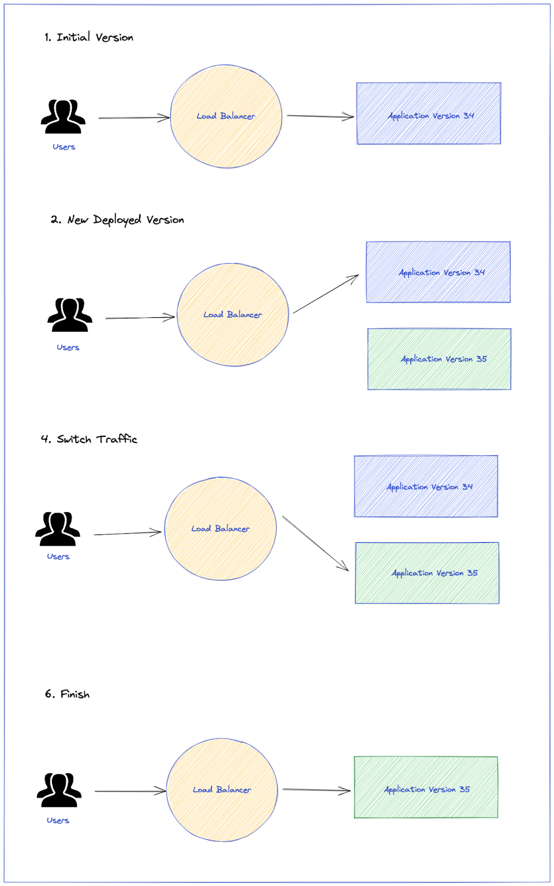

# test-strategies

## 1. Progressive Delivery

Progressive Delivery is a modern software development lifecycle that builds upon the core tenets of Continuous Integration and Continuous Delivery (CI/CD). Organizations that employ Progressive Delivery ship code faster, reduce risk, and continuously improve the customer experience.

https://launchdarkly.com/blog/what-is-progressive-delivery-all-about/

```text
Speed with control. And that is precisely what Progressive Delivery enables.
```

### Control Over:
* Which users see which features
* Timing of when engineers deploy changes to production
* When such changes get released to customers
* Who in an organization is allowed to release features

**************************************

### Release Progressions:
* Targeted roll outs
* Canary launches
* Ring deployments
* Percentage roll outs
* And so on.. 


## 2. Progressive delegation (Giving PMs the ability to control the release experience)
* Engineers create a feature
* Test the feature
* Product Manager - To control the process of launching that feature
    * PMs are closer to the end-users for whom the new functionality is designed

## 3. Ring deployments

* Divide users into groups, or rings
* Each ring representing a different stage of a rollout
* Org gradually rolls new features out to each ring
    * Canary group (Ring zero / **Staff Ship**) - If testing is good, then deploy to another ring
    * Alpha Users (User group is larger than canary group) 
    * Beta Users (User group is larger than alpha group) 
    * Public (To everyone) 


**************************************

* Feature flagging
* Dark launches
* Canary testing
* A/B testing
* blue-green deployments


## Blue Green Deployments

```
Enable new feature for 100 % of users

With Service Mesh, feature can be deployed to selective users
```

Increase the agility and confidence of application teams by reducing the risk of outages when deploying new releases.

* It has both the new and old version of the application deployed at the same time
* During this time, only the old version of the application will receive production traffic
* This allows the developers to run tests against the new version before switching the live traffic to the new version



## Possible ways of Blue Green Deployments

### 1. Service Meshes

### 2. Feature Flags

**************************************

## Canary Deployments

```
Enable new feature for selective % of users (A/B testing)

Faster way of getting user feedback
```

* Rolling deployments (Deploy one after other server)
* Side by side deployments 


## Continuous Testing

https://launchdarkly.com/blog/what-is-continuous-testing-a-straightforward-introduction1/

## Shift Left Testing